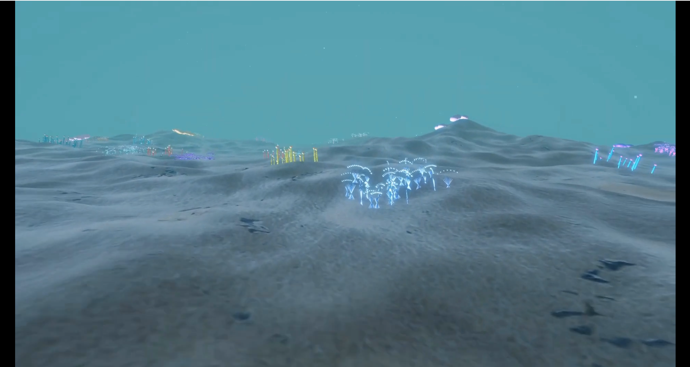
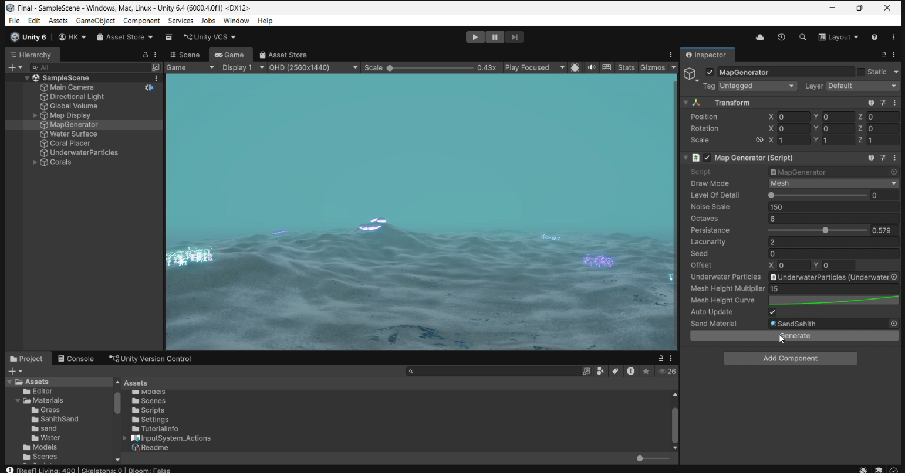
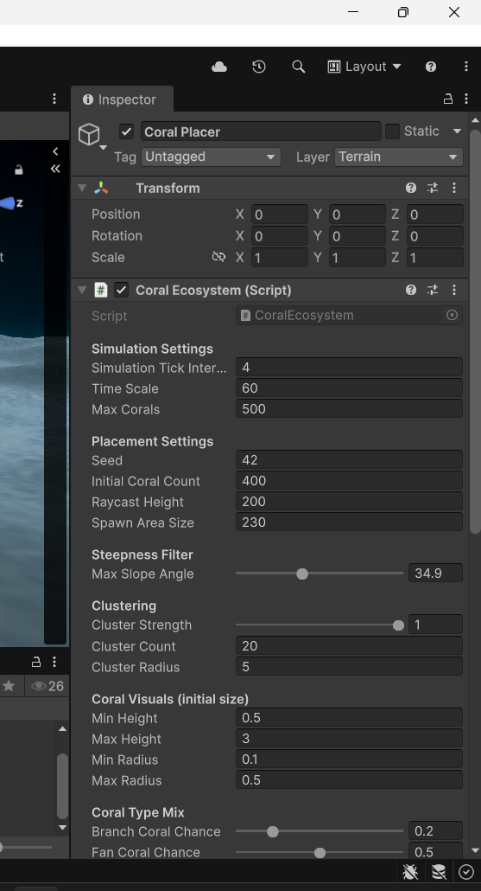

# Coral Reef Simulation — Proof of Concept

## Overview

The proof of concept implements a fully seeded, deterministic coral reef simulation system built in Unity — a working pipeline from noise-generated terrain through to living, evolving coral agents — and prove that the system can behave in a biologically plausible way before any serious rendering or ML work begins.

What exists now is a prototype that already does more than most procedural systems at this stage, while being honest about what is placeholder and what is production-ready.

---

## The Terrain Foundation

The terrain pipeline follows the classic fractal Brownian motion approach — the same mathematical foundation demonstrated in the entry task, now operating inside Unity on a 241×241 mesh chunk.

The choice of 241 is deliberate: it is a value that divides cleanly for LOD simplification without hitting Unity's mesh vertex limit.

The noise generator is fully seeded using System.Random, meaning every terrain, every coral placement, every ecosystem simulation is reproducible from a single integer. Give it seed 42 today and seed 42 in six months — on your device or anyone else's — and you get the exact same reef.

The heightmap drives a mesh through MeshGenerator.cs, where each vertex's Y position is shaped by an AnimationCurve before being multiplied by a height scalar.

This non-linear shaping is important — it lets you flatten the abyssal plains while sharpening the reef ridges, mimicking how real reefs rise steeply from a sandy basin.

LOD is already wired in, with mesh simplification incrementing based on distance, even though the system currently generates a single fixed chunk. That LOD infrastructure is the hook for the streaming world expansion later.

---

## The Coral Placement System — What It Does Now

The coral placement logic in CoralEcosystem.cs is the most sophisticated part of the current prototype, and it is worth being specific about how it works because it already goes well beyond naive random scattering.

Corals are not dropped uniformly across the terrain.

Placement uses a cluster-based seeding strategy — clusterCount, clusterRadius, and clusterStrength parameters define how many hotspots exist on the reef and how densely corals concentrate around each one.

This mirrors how real reefs form: coral larvae settle in clusters around existing structure, not evenly across open sand.

Each candidate position is then filtered by slope angle — corals do not spawn on surfaces steeper than maxSlopeAngle — and a raycast confirms the point actually lands on terrain geometry before a coral agent is instantiated there.

Seven coral types are defined: Branch, Fan, Brain, Staghorn, Tube, Mushroom, and Bush.

Each type carries its own parameters — maximum age, stress tolerance, growth rate characteristics — and placement is a weighted random mix across types.

This means different seeds produce reefs with different species compositions, some dominated by branching staghorn colonies, others with dense brain coral clusters.

For now, the actual 3D coral objects are placeholders.

The system instantiates Unity primitive objects or simple proxy meshes at spawn positions to represent each coral agent.

The placement logic, the agent behavior, the simulation ticks — all of that is real and running.

The visual representation is a stand-in.

This was an intentional decision: getting the simulation correct matters far more at this stage than getting the visuals right.

You cannot retrofit biologically plausible behavior onto pretty meshes after the fact, but you absolutely can swap placeholder geometry for Blender-authored coral models once the system underneath is solid.

---

## The Coral Agent Simulation — Rule-Based Ecosystem Intelligence

Each spawned coral is not a static object.

It is an independent agent running its own lifecycle through CoralAgent.cs, and the ecosystem simulation in CoralEcosystem.cs ticks forward on a configurable interval — every 4 real-time seconds representing 60 simulation seconds, giving the reef a sense of geological time passing.

Each agent tracks health, age, stress, and growth rate.

Growth follows a logistic curve — corals grow quickly when young and healthy, slow as they approach maturity, and eventually plateau.

This is biologically accurate: real coral growth is not linear.

Competition is handled through Physics.OverlapSphere — when a coral checks its neighborhood and finds too many neighboring agents within its competition radius, its stress increases and its growth rate is suppressed.

Overcrowded corals bleach.

The bleaching is both a simulation state and a visual one: the agent shifts its material color toward white as stress accumulates, recovering slowly if competition pressure is relieved.

Reproduction happens probabilistically on each tick.

Healthy corals above a certain age have a reproductionChancePerTick chance of spawning a juvenile agent nearby, inheriting the parent's type with some variation.

Juveniles start at a small scale and grow over time.

The total population is capped at 500 agents for performance, with the oldest or most stressed corals dying first when the cap is reached — another ecological pressure that shapes the composition of the reef over time.

Seasonal nutrient blooms fire on a configurable interval, temporarily boosting growth rates across the entire ecosystem — simulating the effect of upwelling events that deliver cold, nutrient-rich water to shallow reefs.

These blooms cause population spikes followed by competition pressure, which then causes partial bleaching and die-off, which opens space for new reproduction.

The system cycles through this naturally without any explicit scripting of the cycle — it emerges from the rules.

---

## Environmental Motion and Camera

UnderwaterParticles.cs configures a particle system for ambient underwater atmosphere — bubbles and sediment drifting upward with gentle noise-based sway.

It runs in world space and uses URP's unlit particle material.

This is entirely visual scaffolding at this stage, but it establishes the right feel for the environment.

ReefCinematicCamera.cs is a five-phase sequenced camera that pans across the seabed, rises to reveal the full reef, orbits wide, moves in for coral close-ups, and pulls back for a final establishing shot.

---

## Where the Prototype Ends and the Full System Begins

The current system is a single 241×241 fixed chunk.

There is   no chunk streaming, no Job System or Burst Compiler, no Compute Shaders.

The rendering is a basic URP mesh with a sand material.

There is no custom water shader, no caustics, no light refraction, no volumetric underwater fog.

The coral objects are placeholders, not authored assets.

The AI layer is entirely rule-based — there are no ML models yet.

These are not failures. They are the correct scope for a proof of concept.

The architecture was designed with every one of these expansions in mind.

---

## Expansion Path

### Streaming and infinite world

The 241×241 chunk size and the existing LOD infrastructure are the exact primitives needed for a chunked infinite world.

The noise generator is already offset-aware, meaning you can request any region of the infinite noise field by passing a world-space offset.

Streaming means generating chunks on a background thread as the user moves, maintaining a ring of loaded chunks around the camera, and unloading distant ones.

The seeded determinism means unloaded chunks can be regenerated identically on demand — you never need to store terrain data persistently.

### Authored coral models

The agent system places, scales, rotates, and manages the lifecycle of coral objects without caring what those objects look like.

Replacing the placeholder meshes with Blender-authored coral models with proper UV maps, normal maps, and material setups is a drop-in substitution.

The simulation does not change.

This is the correct separation of concerns — behavior is decoupled from representation.

### Procedural coral geometry

Beyond static authored models, the full system will generate coral geometry procedurally using L-systems or space colonization algorithms driven by the agent's type and age parameters.

A young Branch coral starts as a single thin cylinder.

Over simulation time it forks, grows secondary branches, develops the characteristic silhouette of a mature colony.

The geometry changes as the agent ages, making growth visible rather than just a scale change on a static mesh.

### Custom rendering

The full system needs a proper underwater visual stack: a water surface shader with refraction and reflection, caustic light projection onto the seabed, volumetric scattering for the characteristic blue-green underwater depth fog, and screen-space effects that shift color temperature with depth.

None of this changes the simulation — it is a rendering layer that sits on top of the existing architecture.

### ML integration

The rule-based simulation is already producing biologically plausible behavior through hand-tuned parameters.

The ML layer, described as optional in the project specification, would replace or augment those hand-tuned values.

A model trained on real reef survey data — species distribution, growth rates by depth and temperature, competition outcomes — could output ecologically accurate parameter sets for a given biome profile rather than requiring manual tuning.

The generator stays fully deterministic; the ML just configures it intelligently from data.

A lighter application is behavior prediction: training a small model on the simulation's own output to predict likely ecosystem states several ticks ahead, enabling the system to skip expensive simulation steps for distant or occluded reef sections.

### Performance at mobile scale

The current system runs on the Unity main thread with no parallelism.

For AR on mid-range Android hardware, the coral simulation ticks, mesh generation, and placement logic all need to move to background threads using Unity's Job System with Burst compilation.

The particle system and LOD pipeline need profiling and budgeting.

The coral agent cap of 500 is conservative — with instanced rendering and GPU-side culling, the visual representation of several thousand coral objects becomes feasible even if the simulation still manages a smaller active population.

## What the Prototype Proves

The proof of concept demonstrates three things that matter for the full project.

First, that deterministic seed-based generation works correctly — the same seed produces identical terrain and identical ecosystem state every time, which is the non-negotiable requirement for synchronized AR experiences.

Second, that a rule-based agent simulation can produce emergent ecological behavior — growth cycles, bleaching events, population dynamics — without explicitly scripting any of it.

Third, that the architecture separates concerns cleanly enough that every layer — terrain, placement, simulation, rendering — can be upgraded independently without rebuilding the system.

## Final Note

The placeholder corals will become authored assets and then procedural geometry.

The single chunk will become a streaming world.

The rule-based parameters will be informed by ML.

The basic URP mesh will become a full underwater rendering pipeline.
